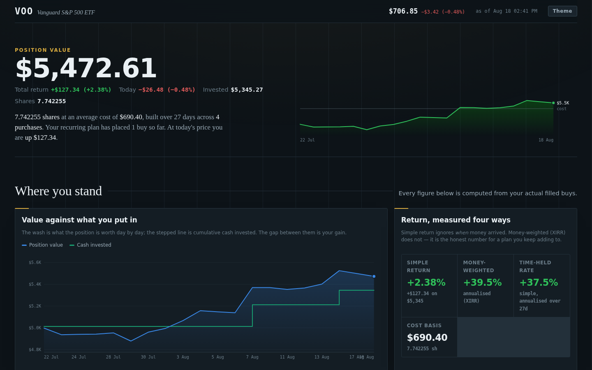

# VOO Compounding Table

A single-page dashboard for a monthly VOO position: real tax lots, real cost basis,
sixteen years of fund history, and a simulated forward path. No dependencies, no
build toolchain beyond two Node scripts, no network calls at runtime.



## What it shows

**Everything you hold** — the whole Robinhood book across all three accounts: total value, a live allocation bar (VOO / crypto / cash, with VOO recomputed from the editable price), a holdings table, per-account tiles, and the realized-P&L history of the earlier NVDA/AMD/BLZE/etc. trades that were rotated into VOO — by ticker, with the full closing-trade log.

**Where you stand** — position value against cash invested (day by day, with a
crosshair), return measured four ways (simple, money-weighted XIRR, time-held
annualised, and versus committing the same cash as one lump sum on day one), and a
sortable tax-lot table with each lot's holding clock and days remaining until it turns
long-term.

**How well you have been buying** — every fill plotted on the tape and sized by dollars,
each fill's percentile inside VOO's trailing 12-month range, break-even with a
price-scenario table, contributions per calendar month split by recurring plan versus
by hand, and where VOO sits in its 52-week range.

**The fund itself** — price history with your buys marked (6M to all-time), drawdown
from the running high since 2010, VOO against VTI / QQQ / SPY / BND indexed to a common
base, every monthly return since 2010, and the risk numbers those returns imply.

**The road ahead** — ten thousand bootstrapped forward paths, run twice off the *same*
return draws: one still contributing and one that stops today, so the gap between them is
purely what future contributions are worth rather than a difference in market luck. Median
lines with an 80% band, a linear/log scale toggle (log makes the coasting path legible
against the contributing one), a table of both futures year by year, milestone meters
carrying a projected date for each case, and a quarterly dividend forecast.

**The counterfactuals** — the same monthly plan run backwards through real VOO prices
from any start month, the share of historical holding periods that ended positive by
length, and rolling annualised returns for every overlapping 1/3/5/10-year window.

**Fund facts** — expense-ratio drag in dollars, valuation and yield, and the claim your
shares represent on the underlying companies' earnings and book value.

## Editing your own numbers

Everything is driven by the buy list and one price. Both are editable in the page:

- **Add a buy** in the tax-lots panel records a new purchase (it prefills the price with
  VOO's actual close on the date you pick).
- **VOO price used** in the Assumptions panel re-runs every panel against a different price.
- **Export CSV** dumps the lots with current values and gains.
- **Reset to brokerage data** discards your edits.

Edits live in `localStorage` under `voo-compounding-table.v1` and never leave the browser.

## Refreshing the data

Source data is captured from the Robinhood MCP tools into `scripts/raw/`, then compiled.

1. Re-fetch and overwrite the payloads in `scripts/raw/`:

   | File | Tool |
   |---|---|
   | `positions.json` | `get_equity_positions` |
   | `tax-lots.json` | `get_equity_tax_lots` (symbol `VOO`) |
   | `orders.json` | `get_equity_orders` (symbol `VOO`, state `filled`) |
   | `quotes.json` | `get_equity_quotes` (`VOO SPY QQQ BND VTI`) |
   | `fundamentals.json` | `get_equity_fundamentals` (`VOO`) |
   | `historicals-monthly.json` | `get_equity_historicals`, interval `month`, from 2010-08 |
   | `historicals-daily.json` | `get_equity_historicals`, interval `day`, trailing ~15 months |
   | `portfolio.json` | `get_portfolio`, once per account |
   | `pnl-history.json` | `get_pnl_trade_history`, span `all` |

   Only the fields the build reads need to be present — see `scripts/build-data.mjs`.

2. Rebuild:

   ```sh
   node scripts/build-data.mjs   # scripts/raw/*.json -> data/dataset.json
   node scripts/build-html.mjs   # + src/dashboard.html -> index.html, dist/artifact.html
   ```

`index.html` is a complete standalone document — open it directly in a browser.
`dist/artifact.html` is the same page without the document wrapper, for publishing as
a Claude Artifact.

## Layout

```
src/dashboard.html     the page: styles, markup, and all logic (the only file to edit)
data/dataset.json      compiled data, inlined at build time
scripts/raw/*.json     captured brokerage and market payloads
scripts/build-data.mjs raw payloads -> dataset
scripts/build-html.mjs dataset + source -> index.html and dist/artifact.html
```

## Method

Price history is **split-adjusted closing prices**, so the series are price return and
exclude dividends. Anything labelled CAGR, monthly return, drawdown or rolling return is
therefore ex-dividend. Where total return matters — the forward simulation — dividends
are added back at the fund's trailing yield, toggleable in the Assumptions panel.

The forward simulation bootstraps monthly returns at random from VOO's own 2010–2026
history with a fixed seed, so the same inputs always give the same chart. That window
covers one of the strongest stretches in the index's life and contains no 1973, 2000 or
2008 in full; real outcomes can fall outside the shaded band. Nothing here is tax or
investment advice.
